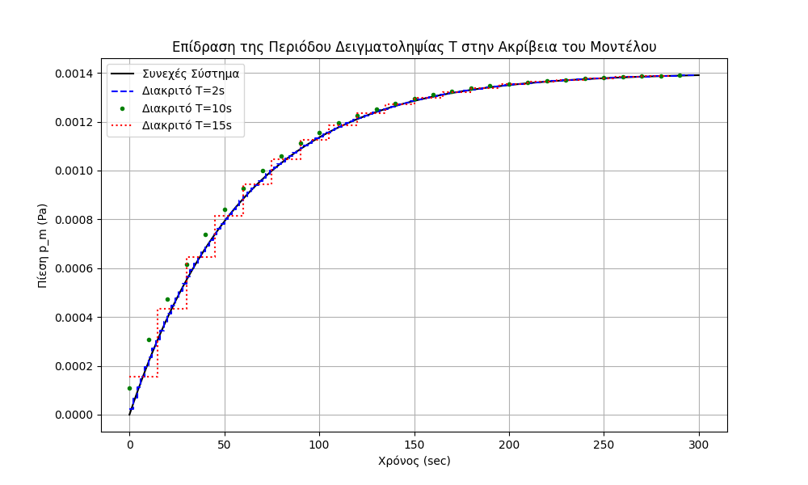
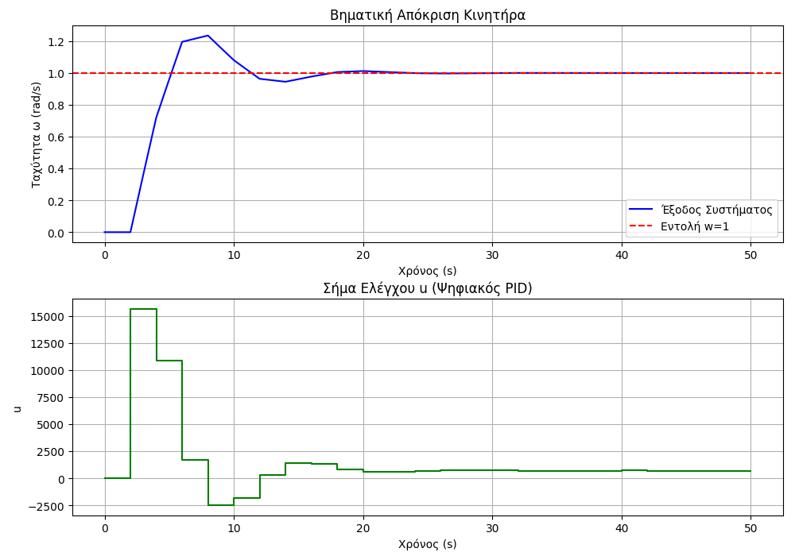
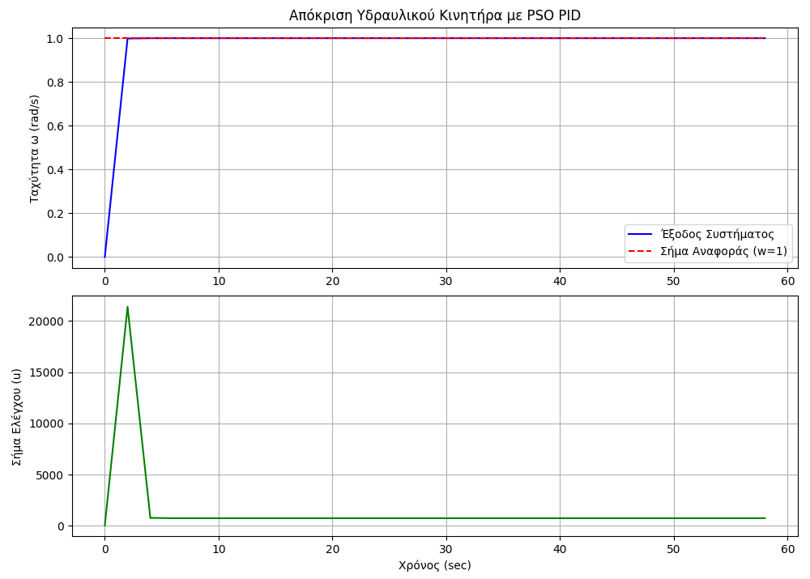

# Digital PID Controller & PSO Tuning: Hydraulic Motor System ⚙️🧠

This repository demonstrates the design, simulation, and optimization of a digital control system for a hydraulic motor. The project bridges classical **Control Theory** with modern **Swarm Intelligence (AI)**, implemented in both **MATLAB** and **Python**.

## 🛠️ Tech Stack
* **Languages:** Python (NumPy, SciPy, Matplotlib), MATLAB
* **Control Theory:** Continuous-to-Discrete Conversion (Tustin/Bilinear), PID Control Design, Difference Equations.
* **Artificial Intelligence:** Particle Swarm Optimization (PSO) algorithm for automated tuning.

---

## 📂 Project Structure & Features

The repository is divided into equivalent `MATLAB` and `PYTHON` directories, each containing three core modules:

### 1. Continuous to Discrete Transformation (Tustin Method)
Converts the continuous-time hydraulic motor model into a discrete-time representation. It evaluates the impact of different sampling periods (T) on the model's accuracy.

### 2. Digital PID Control & Closed-Loop Simulation
Implements a digital PID controller based on a desired closed-loop characteristic polynomial. The simulation runs the discrete controller against the continuous plant using custom numerical integration (Euler approximation) to observe the true step response.

### 3. AI-Driven Tuning: Particle Swarm Optimization (PSO)
Instead of manual pole-placement, a Particle Swarm Optimization (PSO) algorithm is deployed to autonomously search for the optimal proportional, integral, and derivative gains (fp, fi, fd). The algorithm minimizes the tracking error, resulting in an aggressive, near-instantaneous system response with zero overshoot.

